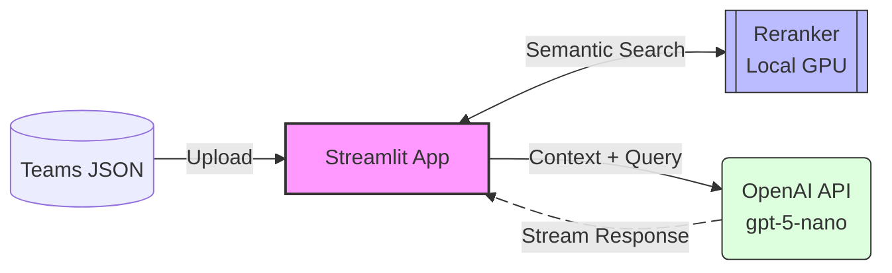

# teams-thread-summarizer: 

TeamsのチャネルスレッドからエクスポートしたJSONファイルを読み込み、可視化・検索・要約を行うためのStreamlitアプリケーションです。

## Features

* **Teams JSONインポート**: 親メッセージおよびリプライを含むJSONファイルをDataFrameとして一括読み込み。
* **インタラクティブ・タイムライン**: Plotly Expressを使用した送信履歴の可視化。スライダーによる期間フィルタリングが可能。
* **Rerankerによる高度な検索**: `sentence-transformers (CrossEncoder)` を使用し、質問に対して文脈が近いメッセージをスコアリングして抽出。
* **AI要約・回答生成**: 抽出されたメッセージをコンテキストとしてLLM（OpenAI）に渡し、スレッドに基づいた回答を生成。
* **GPUモニタリング**: ローカル環境のVRAM使用状況をサイドバーでリアルタイムに監視（NVIDIA GPU搭載環境）。

## Tech Stack

* **Frontend**: Streamlit
* **Data Analysis**: Pandas, Plotly
* **Search Engine**: Sentence-Transformers (Local Rerank Model: `cl-nagoya/ruri-v3-reranker-310m`)
* **LLM**: OpenAI API (`gpt-5-nano` 等)
* **Computing**: PyTorch (CUDA Support)

### システム構成



## Setup

### 1. 依存関係のインストール

`uv` を使用する場合：

```bash
uv sync
```

### 2. 環境変数の設定

`.env` ファイルを作成し、以下の項目を設定してください。

```env
OPENAI_API_KEY=your_api_key_here
LLM_NAME=gpt-5-nano
RERANKER_NAME=cl-nagoya/ruri-v3-reranker-310m
```

### 3. アプリケーションの起動

```bash
streamlit run src/thread_chatbot/main.py
```

## 使い方

1. メイン画面で、Teamsのスレッドデータ（JSON形式）をアップロードします。
2. タイムラインスライダーを操作して、解析対象とするメッセージの期間を絞り込みます。
3. 画面下部のチャット入力欄に質問（例：「このスレッドの決定事項を教えて」）を入力します。
4. **Action** 設定で挙動を選択します。
* **Rerank**: 関連度の高いメッセージを抽出して表示します。
* **Generate**: 抽出したメッセージを元にAIが要約回答を作成します。

### JSONスキーマ

アプリ利用のために必要な最低限のJSON構造：

```json
{
  "parentMessage": {
    "id": "string",
    "createdDateTime": "2026-01-27T10:00:00Z",
    "from": {
      "user": {
        "displayName": "string"
      }
    },
    "body": {
      "content": "string (HTML support)"
    }
  },
  "replies": [
    {
      "id": "string",
      "createdDateTime": "2026-01-27T10:05:00Z",
      "from": {
        "user": {
          "displayName": "string"
        }
      },
      "body": {
        "content": "string (HTML support)"
      }
    }
  ]
}
```

## 注意事項

* 本アプリはGPU（CUDA）環境での実行を推奨していますが、未搭載の場合は自動的にCPUモードで動作します。
* OpenAI APIの利用には別途APIキーと利用料が必要です。